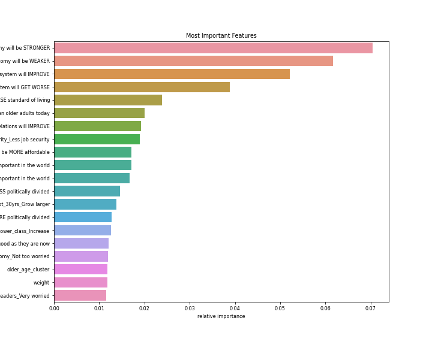
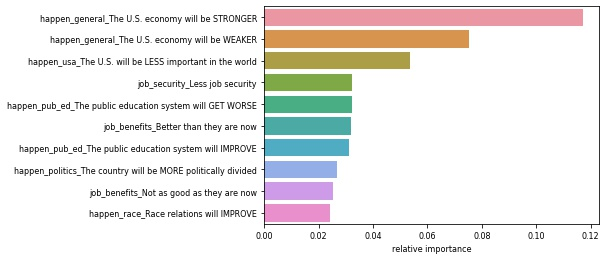
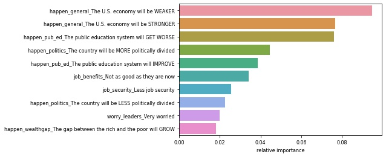
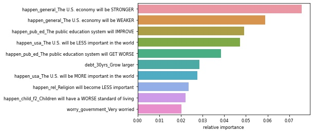
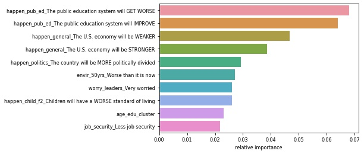
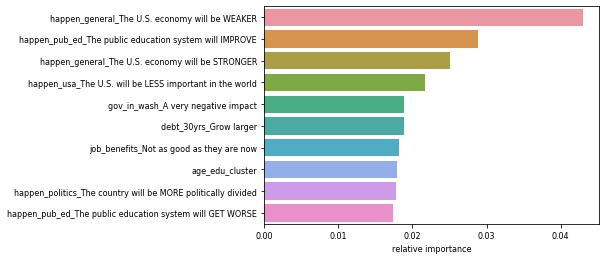
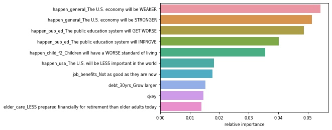
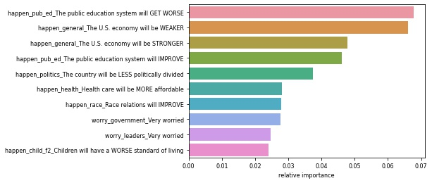
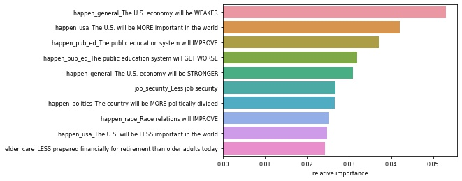
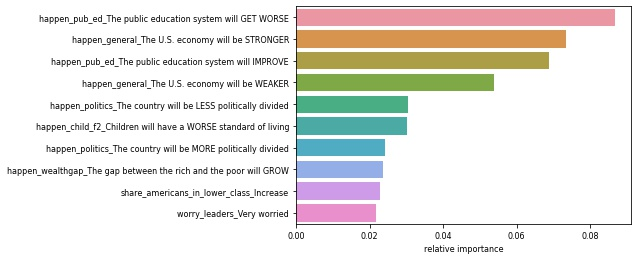

<h1>Is America’s Glass Half-Empty? Discovering drivers of America’s prospective thinking.

#### Authors: <a href="https://github.com/Alexia-Garces" target="_blank">Alexia Garces</a>, <a href="https://github.com/Brooke-Holyoak" target="_blank">Brooke Holyoak</a>, <a href="https://github.com/CharlesAtchison" target="_blank">Charles Atchison</a>, <a href="https://github.com/Jason-Tellez" target="_blank">Jason Tellez</a>, <a href="https://github.com/malachi-hale" target="_blank">Malachi Hale</a>
    
**Date**: November 14, 2021

# Table of Contents 
1. [Project Planning](#project_planning)
    1. [Project Objectives](#project_objectives)
    2. [Business Goals](#business_goals)
    3. [Audience](#audience)
    4. [Deliverables](#deliverables)
2. [Executive Summary](#exe_sum)
    1. [Goals](#goals)
    2. [Findings](#findings)
3. [Acquire Data](#acquire)
    1. [Working with American Trends Panel Data](#working_with_data)
    2. [Data Dictonary](#data_dict) 
    3. [Acquire Takeaways](#acquire_takeaways)
4. [Prepare Data](#prep_data)
    1. [Distributions](#distributions)
    2. [Prepare Takeaways](#prepare_takeaways)
5. [Data Exploration](#explore)
    1. [Correlations](#correlations)
    2. [Pairplot](#pairplot)
    3. [Hypothesis & Testing](#hypotheses)
    4. [Explore Takeaways](#explore_takeaways)
6. [Modeling & Evaluation](#modeling)
    1. [Baseline](#baseline)
    2. [Decision Tree](#decision_tree)
    3. [Random Forest](#random_forest)
    4. [K Nearest Neighbors](#knn)
    5. [Other Models](#other_models)
    6. [Feature Importance](#feature_importance)
    7. [Modeling with just the top features](#top)
    9. [Model Comparison](#model_comparison)
    10. [Out of Sample Testing](#out_of_sample)
    11. [Modeling the Gender Subsets)(#modeling_gender)
    12. [Modeling the Political Party Subsets](#modeling_politics)
    13. [Modeling the Income Level Subsets](#modeling_income_level)
    14. [Modeling the Education Level Subsets](#modeling_education_level)
    15. [Modeling Takeaways](#modeling_takeaways)
7. [Project Delivery](#delivery)
    1. [Conclusion & Next Steps](#conclusion_and_next_steps)
    2. [Project Replication](#replicate)
    3. [Data Use Agreements](#data_use)

# Project Planning
✓ 🟢 **Plan** ➜ ☐ _Acquire_ ➜ ☐ _Prepare_ ➜ ☐ _Explore_ ➜ ☐ _Model_ ➜ ☐ _Deliver_

## Project Objectives 
> - Utilize American Trends Panel Datasets (downloadable <a href="https://www.kaggle.com/shankanater/american-trends-panel-pewresearch/download">here</a>), with statistical modeling techniques to assess and attempt to predict sentiment toward particular topics.
> - This will culminate into a well-built well-documented jupyter notebook that contains our process and derivation of these predictions.
> - Modules will be created that abstract minutiae aspects of the data pipeline process.

## Business Goals 
> - Utilize tabulated statistical data aquired from Pew Research American Trends Surveys.
> - Prepare, explore and formulate hypthoesis about the data.
> - Build models that can predict future American sentiment toward certain topics, and utilize hyperparameter optimization and feature engineering to improve validation model performance prior to evaluating on test data.
> - Document all these steps throughly.

## Audience 
> - General population and individuals without specific knowledge or understanding of the topic or subject.

## Deliverables
> - A clearly named final notebook. This notebook will contain more detailed processes other than noted within the README and have abstracted scripts to assist on readability.
> - A README that explains what the project is, how to reproduce the project, and notes about the project.
> - A Python module and associated modules that automate the data acquisition and preparation process. 

<a href='#toc'>Table of Contents</a>

# Executive Summary
> - Our team acquired Pew Research Panel survey data and utilized this data to explore the drivers of pessimism in American Prospective Attitudes.
> - Being able to understand what most likely drives pessimistic or optimistic thinking about the future will help business leaders clarify strategies for moving foward.
> - This project will also help guide expectations of future sucess in the customers these business leaders serve, in addition to the products offered, investment, marketing and sales, and other aspects throughout their organization. 

## Goals
> - Build a model that can predict future American sentiment toward certain topics, utilizing split survey data as the training dataset.

## Findings
> - Standard demographic features like age, sex, and income are not drivers of overall pessimism. However, features like what will happen to the average family's standard of living, cost of healthcare, and the future of the public education system are highly correlated to overall pessimism.

<a href='#toc'>Table of Contents</a>

# Acquire Data
✓ _Plan_ ➜ 🟢 **Acquire** ➜ ☐ _Prepare_ ➜ ☐ _Explore_ ➜ ☐ _Model_ ➜ ☐ _Deliver_

> - The data is acquired from Pew Research Panel survey data that asks various demographic questions in conjunction with the survey questions themselves.
> - The questions all ask for categorical responses from the individuals and the questions pertain to various topics of American life, such as politics and economics.

## Working with American Trends Panel Data 

### Demographic Profile Variables
> Each ATP dataset comes with a number of variables prefixed by “F_” (for “frame”) that contain demographic profile data. These variables are not measured every wave; instead, they are sourced from panel profile surveys conducted on a less frequent basis. Some profile variables are also occasionally asked on panel waves and are accordingly updated for each panelist. Profile information is based on panelists’ most recent response to the profile questions. Some variables are coarsened to help protect the confidentiality of our panelists. Interviewer instructions in `[ ]` and voluntary responses in `( )` are included if the source of a profile variable was ever presented in phone (CATI) mode. See Appendix I for the profile variable codebook.

###  Unique Identifier
> The variable `QKEY` is a unique identifier assigned to each respondent. `QKEY` can be used to link multiple panel waves together. Note that except in a few instances, `WEIGHT_W41` are only provided for single waves. Use caution when analyzing data from multiple waves without weights that are designed for use with multiple waves.

### Data Variable Types
 > American Trends Panel datasets contain single-punch or multi-punch variables. For questions in a 'Check all that apply' format, each option has its own variable indicating whether a respondent selected the item or not. For some datasets there is an additional variable indicating whether a respondent did not select any of the options. Open-end string variables are not included in ATP datasets. Coded responses to open-end questions are included when available.

### Dataset Format
> The dataset is formatted as a .sav file and can be read with the SPSS software program. The dataset can also be read with the R programming language, using the `foreign` package. R is a free, open-source program for statistical analysis that can be downloaded <a href="https://cran.r-project.org/" target="_blank">here</a>. It can also be used to export data in .csv format for use with other software programs.

> **NOTE**: Using other tools to directly convert the .sav file to another format such as .csv may ERASE value
labels. For this reason, it is highly recommended that you use either SPSS or R to read the file directly.

## DataFrame Dictionary

<table>
<th style="text-align:left">Original Column Name</th>
<th></th><th style="text-align:left">New Column Name</th><th style="text-align:center">Question</th><th style="text-align:center">Responses</th><tr><tr>
        <td style="text-align:left"><code>FTRWORRYa_W41</code></td>
        <td style="text-align:right">&rarr;</td>
        <td style="text-align:left"><code>worry_economy</code></td>
        <td style="text-align:center">How worried are you, if at all, about the overall soundess of our economic system?</td>
        <td><ul>1 Not too worried</ul><ul>2 Fairly worried</ul><ul>3 Very worried</ul><ul>4 Not at all worried</ul><ul>5 Refused</ul></td>
    </tr><tr>
        <td style="text-align:left"><code>FTRWORRYb_W41</code></td>
        <td style="text-align:right">&rarr;</td>
        <td style="text-align:left"><code>worry_public_schools</code></td>
        <td style="text-align:center">How worried are you, if at all, about the ability of public schools to provide a quality education?</td>
        <td><ul>1 Fairly worried</ul><ul>2 Very worried</ul><ul>3 Not too worried</ul><ul>4 Not at all worried</ul><ul>5 Refused</ul></td>
    </tr><tr>
        <td style="text-align:left"><code>FTRWORRYc_W41</code></td>
        <td style="text-align:right">&rarr;</td>
        <td style="text-align:left"><code>worry_government</code></td>
        <td style="text-align:center">How worried are you, if at all, about the way the government in Washington works?</td>
        <td><ul>1 Fairly worried</ul><ul>2 Very worried</ul><ul>3 Not too worried</ul><ul>4 Not at all worried</ul><ul>5 Refused</ul></td>
    </tr><tr>
        <td style="text-align:left"><code>FTRWORRYd_W41</code></td>
        <td style="text-align:right">&rarr;</td>
        <td style="text-align:left"><code>worry_leaders</code></td>
        <td style="text-align:center">How worried are you, if at all, about the ability of political leaders to solve the country’s biggest problems?</td>
        <td><ul>1 Fairly worried</ul><ul>2 Very worried</ul><ul>3 Not too worried</ul><ul>4 Not at all worried</ul><ul>5 Refused</ul></td>
    </tr><tr>
        <td style="text-align:left"><code>FTRWORRYe_W41</code></td>
        <td style="text-align:right">&rarr;</td>
        <td style="text-align:left"><code>worry_morals</code></td>
        <td style="text-align:center">How worried are you, if at all, about the moral values of Americans?</td>
        <td><ul>1 Fairly worried</ul><ul>2 Very worried</ul><ul>3 Not too worried</ul><ul>4 Not at all worried</ul><ul>5 Refused</ul></td>
    </tr><tr>
        <td style="text-align:left"><code>FTRWORRYf_W41</code></td>
        <td style="text-align:right">&rarr;</td>
        <td style="text-align:left"><code>worry_climate</code></td>
        <td style="text-align:center">How worried are you, if at all, about climate change?</td>
        <td><ul>1 Not too worried</ul><ul>2 Not at all worried</ul><ul>3 Very worried</ul><ul>4 Fairly worried</ul><ul>5 Refused</ul></td>
    </tr><tr>
        <td style="text-align:left"><code>ELDCARE_W41eldcare</code></td>
        <td style="text-align:right">&rarr;</td>
        <td style="text-align:left"><code>elder_care</code></td>
        <td style="text-align:center">Do you think population grown in the US will be...?</td>
        <td><ul>1 LESS prepared financially for retirement than older adults today</ul><ul>2 BETTER prepared financially for retirement than older adults are today</ul><ul>3 Refused</ul></td>
    </tr><tr>
        <td style="text-align:left"><code>ELDFINANCEF1_W41</code></td>
        <td style="text-align:right">&rarr;</td>
        <td style="text-align:left"><code>elder_finance_1</code></td>
        <td style="text-align:center">Who do you think will be mostly responsible for paying for the long-term care older Americans may need?</td>
        <td><ul>1 Family members</ul><ul>2 Older Americans themselves</ul><ul>3 Refused</ul><ul>4 Government</ul><ul>5 nan</ul></td>
    </tr><tr>
        <td style="text-align:left"><code>ELDFINANCEF2_W41</code></td>
        <td style="text-align:right">&rarr;</td>
        <td style="text-align:left"><code>elder_finance_2</code></td>
        <td style="text-align:center">Who do you think should be mostly responsible for paying for the long-term care older Americans may need?</td>
        <td><ul>1 nan</ul><ul>2 Government</ul><ul>3 Family members</ul><ul>4 Older Americans themselves</ul><ul>5 Refused</ul></td>
    </tr><tr>
        <td style="text-align:left"><code>GOVPRIOa_W41</code></td>
        <td style="text-align:right">&rarr;</td>
        <td style="text-align:left"><code>priority_debt</code></td>
        <td style="text-align:center">If you were deciding what the federal government should do to improve the quality of life for future generations, what priority would you give to the national debt?</td>
        <td><ul>1 A lower priority</ul><ul>2 A top priority</ul><ul>3 An important, but not a top priority</ul><ul>4 Should not be done</ul><ul>5 Refused</ul></td>
    </tr><tr>
        <td style="text-align:left"><code>GOVPRIOb_W41</code></td>
        <td style="text-align:right">&rarr;</td>
        <td style="text-align:left"><code>priority_education</code></td>
        <td style="text-align:center">If you were deciding what the federal government should do to improve the quality of life for future generations, what priority would you give to increasing spending for education?</td>
        <td><ul>1 An important, but not a top priority</ul><ul>2 A top priority</ul><ul>3 Should not be done</ul><ul>4 A lower priority</ul><ul>5 Refused</ul></td>
    </tr><tr>
        <td style="text-align:left"><code>GOVPRIOc_W41</code></td>
        <td style="text-align:right">&rarr;</td>
        <td style="text-align:left"><code>priority_healthcare</code></td>
        <td style="text-align:center">If you were deciding what the federal government should do to improve the quality of life for future generations, what priority would you give to providing high-quality, affordable health care to all Americans?</td>
        <td><ul>1 A lower priority</ul><ul>2 A top priority</ul><ul>3 An important, but not a top priority</ul><ul>4 Should not be done</ul><ul>5 Refused</ul></td>
    </tr><tr>
        <td style="text-align:left"><code>GOVPRIOd_W41</code></td>
        <td style="text-align:right">&rarr;</td>
        <td style="text-align:left"><code>priority_science</code></td>
        <td style="text-align:center">If you were deciding what the federal government should do to improve the quality of life for future generations, what priority would you give to increasing spending on scientific research?</td>
        <td><ul>1 An important, but not a top priority</ul><ul>2 A lower priority</ul><ul>3 Should not be done</ul><ul>4 A top priority</ul><ul>5 Refused</ul></td>
    </tr><tr>
        <td style="text-align:left"><code>GOVPRIOe_W41</code></td>
        <td style="text-align:right">&rarr;</td>
        <td style="text-align:left"><code>priority_inequality</code></td>
        <td style="text-align:center">If you were deciding what the federal government should do to improve the quality of life for future generations, what priority would you give to reducing the gap between the rich and the poor?</td>
        <td><ul>1 A top priority</ul><ul>2 An important, but not a top priority</ul><ul>3 A lower priority</ul><ul>4 Should not be done</ul><ul>5 Refused</ul></td>
    </tr><tr>
        <td style="text-align:left"><code>GOVPRIOfF1_W41</code></td>
        <td style="text-align:right">&rarr;</td>
        <td style="text-align:left"><code>priority_reduce_military</code></td>
        <td style="text-align:center">If you were deciding what the federal government should do to improve the quality of life for future generations, what priority would you give to reducing military spending?</td>
        <td><ul>1 A lower priority</ul><ul>2 An important, but not a top priority</ul><ul>3 Should not be done</ul><ul>4 nan</ul><ul>5 A top priority</ul><ul>6 Refused</ul></td>
    </tr><tr>
        <td style="text-align:left"><code>GOVPRIOgF1_W41</code></td>
        <td style="text-align:right">&rarr;</td>
        <td style="text-align:left"><code>priority_undocumented_immigration</code></td>
        <td style="text-align:center">If you were deciding what the federal government should do to improve the quality of life for future generations, what priority would you give to reducing the number of undocumented immigrants coming into the US?</td>
        <td><ul>1 A top priority</ul><ul>2 An important, but not a top priority</ul><ul>3 A lower priority</ul><ul>4 nan</ul><ul>5 Should not be done</ul><ul>6 Refused</ul></td>
    </tr><tr>
        <td style="text-align:left"><code>GOVPRIOhF1_W41</code></td>
        <td style="text-align:right">&rarr;</td>
        <td style="text-align:left"><code>priority_increase_social_security</code></td>
        <td style="text-align:center">If you were deciding what the federal government should do to improve the quality of life for future generations, what priority would you give to reducing spending on Social Security, Medicare and Medicaid?</td>
        <td><ul>1 A top priority</ul><ul>2 Should not be done</ul><ul>3 An important, but not a top priority</ul><ul>4 nan</ul><ul>5 A lower priority</ul><ul>6 Refused</ul></td>
    </tr><tr>
        <td style="text-align:left"><code>GOVPRIOjF1_W41</code></td>
        <td style="text-align:right">&rarr;</td>
        <td style="text-align:left"><code>priority_avoid_tax_increase</code></td>
        <td style="text-align:center">If you were deciding what the federal government should do to improve the quality of life for future generations, what priority would you give to avoiding tax increases?</td>
        <td><ul>1 A top priority</ul><ul>2 An important, but not a top priority</ul><ul>3 A lower priority</ul><ul>4 nan</ul><ul>5 Should not be done</ul></td>
    </tr><tr>
        <td style="text-align:left"><code>GOVPRIOkF2_W41</code></td>
        <td style="text-align:right">&rarr;</td>
        <td style="text-align:left"><code>priority_increase_military</code></td>
        <td style="text-align:center">If you were deciding what the federal government should do to improve the quality of life for future generations, what priority would you give to increasing military spending?</td>
        <td><ul>1 nan</ul><ul>2 An important, but not a top priority</ul><ul>3 A lower priority</ul><ul>4 A top priority</ul><ul>5 Should not be done</ul><ul>6 Refused</ul></td>
    </tr><tr>
        <td style="text-align:left"><code>GOVPRIOlF2_W41</code></td>
        <td style="text-align:right">&rarr;</td>
        <td style="text-align:left"><code>priority_more_immigration</code></td>
        <td style="text-align:center">If you were deciding what the federal government should do to improve the quality of life for future generations, what priority would you give to allowing more immigrants into the US who come here legally?</td>
        <td><ul>1 nan</ul><ul>2 Should not be done</ul><ul>3 An important, but not a top priority</ul><ul>4 A lower priority</ul><ul>5 A top priority</ul><ul>6 Refused</ul></td>
    </tr><tr>
        <td style="text-align:left"><code>GOVPRIOnF2_W41</code></td>
        <td style="text-align:right">&rarr;</td>
        <td style="text-align:left"><code>priority_reducing_spending_infrastructure</code></td>
        <td style="text-align:center">If you were deciding what the federal government should do to improve the quality of life for future generations, what priority would you give to reducing spending for roads, bridges and other infrastructure?</td>
        <td><ul>1 nan</ul><ul>2 Should not be done</ul><ul>3 An important, but not a top priority</ul><ul>4 A top priority</ul><ul>5 A lower priority</ul><ul>6 Refused</ul></td>
    </tr><tr>
        <td style="text-align:left"><code>GOVPRIOoF2_W41</code></td>
        <td style="text-align:right">&rarr;</td>
        <td style="text-align:left"><code>priority_climate</code></td>
        <td style="text-align:center">If you were deciding what the federal government should do to improve the quality of life for future generations, what priority would you give to dealing with climate change?</td>
        <td><ul>1 nan</ul><ul>2 A top priority</ul><ul>3 An important, but not a top priority</ul><ul>4 A lower priority</ul><ul>5 Should not be done</ul><ul>6 Refused</ul></td>
    </tr><tr>
        <td style="text-align:left"><code>SOLVPROBa_W41</code></td>
        <td style="text-align:right">&rarr;</td>
        <td style="text-align:left"><code>sci_tech</code></td>
        <td style="text-align:center">In the future, what kind of an impact do you think Science and Technology will have in solving the biggest problems facing the country?</td>
        <td><ul>1 A very positive impact</ul><ul>2 A somewhat negative impact</ul><ul>3 A somewhat positive impact</ul><ul>4 A very negative impact</ul><ul>5 Refused</ul></td>
    </tr><tr>
        <td style="text-align:left"><code>SOLVPROBb_W41</code></td>
        <td style="text-align:right">&rarr;</td>
        <td style="text-align:left"><code>major_corps</code></td>
        <td style="text-align:center">In the future, what kind of an impact do you think Major Corporations will have in solving the biggest problems facing the country?</td>
        <td><ul>1 A somewhat positive impact</ul><ul>2 A somewhat negative impact</ul><ul>3 A very negative impact</ul><ul>4 A very positive impact</ul><ul>5 Refused</ul></td>
    </tr><tr>
        <td style="text-align:left"><code>SOLVPROBc_W41</code></td>
        <td style="text-align:right">&rarr;</td>
        <td style="text-align:left"><code>rel_groups</code></td>
        <td style="text-align:center">In the future, what kind of an impact do you think Religious Groups will have in solving the biggest problems facing the country?</td>
        <td><ul>1 A somewhat positive impact</ul><ul>2 A somewhat negative impact</ul><ul>3 A very positive impact</ul><ul>4 A very negative impact</ul><ul>5 Refused</ul></td>
    </tr><tr>
        <td style="text-align:left"><code>SOLVPROBdF1_W41</code></td>
        <td style="text-align:right">&rarr;</td>
        <td style="text-align:left"><code>gov_in_wash</code></td>
        <td style="text-align:center">In the future, what kind of an impact do you think the Government in Washington will have in solving the biggest problems facing the country?</td>
        <td><ul>1 A somewhat positive impact</ul><ul>2 A very negative impact</ul><ul>3 A somewhat negative impact</ul><ul>4 nan</ul><ul>5 A very positive impact</ul><ul>6 Refused</ul></td>
    </tr><tr>
        <td style="text-align:left"><code>SOLVPROBeF2_W41</code></td>
        <td style="text-align:right">&rarr;</td>
        <td style="text-align:left"><code>state_local</code></td>
        <td style="text-align:center">In the future, what kind of an impact do you think State and Local Government will have in solving the biggest problems facing the country?</td>
        <td><ul>1 nan</ul><ul>2 A somewhat negative impact</ul><ul>3 A very positive impact</ul><ul>4 A very negative impact</ul><ul>5 A somewhat positive impact</ul><ul>6 Refused</ul></td>
    </tr><tr>
        <td style="text-align:left"><code>SOLVPROBf_W41</code></td>
        <td style="text-align:right">&rarr;</td>
        <td style="text-align:left"><code>media</code></td>
        <td style="text-align:center">In the future, what kind of an impact do you think the News Media will have in solving the biggest problems facing the country?</td>
        <td><ul>1 A somewhat negative impact</ul><ul>2 A very negative impact</ul><ul>3 A somewhat positive impact</ul><ul>4 A very positive impact</ul><ul>5 Refused</ul></td>
    </tr><tr>
        <td style="text-align:left"><code>SOLVPROBg_W41</code></td>
        <td style="text-align:right">&rarr;</td>
        <td style="text-align:left"><code>military</code></td>
        <td style="text-align:center">In the future, what kind of an impact do you think the Military will have in solving the biggest problems facing the country?</td>
        <td><ul>1 A somewhat positive impact</ul><ul>2 A very positive impact</ul><ul>3 A very negative impact</ul><ul>4 A somewhat negative impact</ul><ul>5 Refused</ul></td>
    </tr><tr>
        <td style="text-align:left"><code>SOLVPROBh_W41</code></td>
        <td style="text-align:right">&rarr;</td>
        <td style="text-align:left"><code>college_uni</code></td>
        <td style="text-align:center">In the future, what kind of an impact do you think Colleges and Universities will have in solving the biggest problems facing the country?</td>
        <td><ul>1 A somewhat positive impact</ul><ul>2 A very negative impact</ul><ul>3 A very positive impact</ul><ul>4 A somewhat negative impact</ul><ul>5 Refused</ul></td>
    </tr><tr>
        <td style="text-align:left"><code>SOLVPROBi_W41</code></td>
        <td style="text-align:right">&rarr;</td>
        <td style="text-align:left"><code>schools</code></td>
        <td style="text-align:center">In the future, what kind of an impact do you think Public K-12 Schools will have in solving the biggest problems facing the country?</td>
        <td><ul>1 A somewhat positive impact</ul><ul>2 A very positive impact</ul><ul>3 A somewhat negative impact</ul><ul>4 A very negative impact</ul><ul>5 Refused</ul></td>
    </tr><tr>
        <td style="text-align:left"><code>HARASS1F1a_W41</code></td>
        <td style="text-align:right">&rarr;</td>
        <td style="text-align:left"><code>harass_false_f1</code></td>
        <td style="text-align:center">When it comes to sexual harassment and sexual assault in the workplace today, how much of a problem, if at all, would you say is women claiming they have experienced sexual harassment or assault when it hasn’t actually occurred?</td>
        <td><ul>1 Major problem</ul><ul>2 Minor problem</ul><ul>3 nan</ul><ul>4 Not a problem</ul><ul>5 Refused</ul></td>
    </tr><tr>
        <td style="text-align:left"><code>HARASS1F1b_W41</code></td>
        <td style="text-align:right">&rarr;</td>
        <td style="text-align:left"><code>harass_fired_f1</code></td>
        <td style="text-align:center">When it comes to sexual harassment and sexual assault in the workplace today, how much of a problem, if at all, would you say is employers firing men who have been accused of sexual harassment or assault before finding out all the facts?</td>
        <td><ul>1 Major problem</ul><ul>2 Refused</ul><ul>3 Minor problem</ul><ul>4 Not a problem</ul><ul>5 nan</ul></td>
    </tr><tr>
        <td style="text-align:left"><code>HARASS1F1c_W41</code></td>
        <td style="text-align:right">&rarr;</td>
        <td style="text-align:left"><code>harass_unpunished_f1</code></td>
        <td style="text-align:center">When it comes to sexual harassment and sexual assault in the workplace today, how much of a problem, if at all, would you say is men getting away with committing sexual harassment or assault?</td>
        <td><ul>1 Minor problem</ul><ul>2 Major problem</ul><ul>3 nan</ul><ul>4 Not a problem</ul><ul>5 Refused</ul></td>
    </tr><tr>
        <td style="text-align:left"><code>HARASS1F1d_W41</code></td>
        <td style="text-align:right">&rarr;</td>
        <td style="text-align:left"><code>harass_unbelieved_f1</code></td>
        <td style="text-align:center">When it comes to sexual harassment and sexual assault in the workplace today, how much of a problem, if at all, would you say is women not being believed when they claim that they have experienced sexual harassment or assault</td>
        <td><ul>1 Minor problem</ul><ul>2 Major problem</ul><ul>3 nan</ul><ul>4 Not a problem</ul><ul>5 Refused</ul></td>
    </tr><tr>
        <td style="text-align:left"><code>HARASS1NOWRKF2a_W41</code></td>
        <td style="text-align:right">&rarr;</td>
        <td style="text-align:left"><code>harass_false_f2</code></td>
        <td style="text-align:center">When it comes to sexual harassment and sexual assault today, how much of a problem, if at all, would you say is women claiming they have experienced sexual harassment or assault when it hasn’t actually occurred?</td>
        <td><ul>1 nan</ul><ul>2 Minor problem</ul><ul>3 Major problem</ul><ul>4 Not a problem</ul><ul>5 Refused</ul></td>
    </tr><tr>
        <td style="text-align:left"><code>HARASS1NOWRKF2c_W41</code></td>
        <td style="text-align:right">&rarr;</td>
        <td style="text-align:left"><code>harass_unpunished_f2</code></td>
        <td style="text-align:center">When it comes to sexual harassment and sexual assault today, how much of a problem, if at all, would you say is men getting away with committing sexual harassment or assault?</td>
        <td><ul>1 nan</ul><ul>2 Major problem</ul><ul>3 Not a problem</ul><ul>4 Minor problem</ul><ul>5 Refused</ul></td>
    </tr><tr>
        <td style="text-align:left"><code>HARASS1NOWRKF2d_W41</code></td>
        <td style="text-align:right">&rarr;</td>
        <td style="text-align:left"><code>harass_unbelieved_f2</code></td>
        <td style="text-align:center">When it comes to sexual harassment and sexual assault today, how much of a problem, if at all, would you say is women not being believed when they claim that they have experienced sexual harassment or assault?</td>
        <td><ul>1 nan</ul><ul>2 Major problem</ul><ul>3 Minor problem</ul><ul>4 Not a problem</ul><ul>5 Refused</ul></td>
    </tr><tr>
        <td style="text-align:left"><code>HARASS3F1_W41</code></td>
        <td style="text-align:right">&rarr;</td>
        <td style="text-align:left"><code>harass_interactions_f1</code></td>
        <td style="text-align:center">Do you think the increased focus on sexual harassment and assault has made it easier or harder for men to know how to interact with women in the workplace, or hasn’t it made much difference?</td>
        <td><ul>1 Has made it harder for men</ul><ul>2 Hasn't made much difference</ul><ul>3 Has made it easier for men</ul><ul>4 nan</ul><ul>5 Refused</ul></td>
    </tr><tr>
        <td style="text-align:left"><code>HARASS3NOWRKF2_W41</code></td>
        <td style="text-align:right">&rarr;</td>
        <td style="text-align:left"><code>harass_interactions_f2</code></td>
        <td style="text-align:center">Do you think the increased focus on sexual harassment and assault has made it easier or harder for men to know how to interact with women in the workplace, or hasn’t it made much difference?</td>
        <td><ul>1 nan</ul><ul>2 Hasn't made much difference</ul><ul>3 Has made it harder for men</ul><ul>4 Has made it easier for men</ul><ul>5 Refused</ul></td>
    </tr><tr>
        <td style="text-align:left"><code>HARASS4_W41</code></td>
        <td style="text-align:right">&rarr;</td>
        <td style="text-align:left"><code>harass_personal_exp</code></td>
        <td style="text-align:center">Have you ever personally received unwanted sexual advances or verbal or physical harassment of a sexual nature? This can be in any circumstance, whether or not work-related.</td>
        <td><ul>1 No</ul><ul>2 Yes</ul><ul>3 Refused</ul></td>
    </tr><tr>
        <td style="text-align:left"><code>HARASS5_W41</code></td>
        <td style="text-align:right">&rarr;</td>
        <td style="text-align:left"><code>harass_sexual_personal_exp</code></td>
        <td style="text-align:center">Have you received unwanted sexual advances or verbal or physical harassment of a sexual nature…</td>
        <td><ul>1 nan</ul><ul>2 Both</ul><ul>3 In a professional or work setting</ul><ul>4 Outside of a professional or work setting</ul><ul>5 Refused</ul></td>
    </tr><tr>
        <td style="text-align:left"><code>GNATPROB_W41</code></td>
        <td style="text-align:right">&rarr;</td>
        <td style="text-align:left"><code>worries_federal_government</code></td>
        <td style="text-align:center">Over the next 30 years, which of the following worries you more about the federal government?</td>
        <td><ul>1 That the government will be too involved in problems that should be left to businesses and individuals</ul><ul>2 That the government will do too little to solve problems facing the country</ul><ul>3 Refused</ul></td>
    </tr><tr>
        <td style="text-align:left"><code>WRKTRN1F1_W41</code></td>
        <td style="text-align:right">&rarr;</td>
        <td style="text-align:left"><code>most_responsible_for_workers_f1</code></td>
        <td style="text-align:center">Over the next 30 years, who should be MOST responsible for making sure American workers have the right skills and training to get a good job?</td>
        <td><ul>1 Employers</ul><ul>2 Individuals themselves</ul><ul>3 Government</ul><ul>4 nan</ul><ul>5 The education system</ul><ul>6 Refused</ul></td>
    </tr><tr>
        <td style="text-align:left"><code>WRKTRN2F1_W41</code></td>
        <td style="text-align:right">&rarr;</td>
        <td style="text-align:left"><code>second_most_responsible_for_workers_f1</code></td>
        <td style="text-align:center">Who should be the SECOND-MOST responsible for making sure American workers have the right skills and training to get a good job?</td>
        <td><ul>1 The education system</ul><ul>2 Employers</ul><ul>3 nan</ul><ul>4 Individuals themselves</ul><ul>5 Government</ul><ul>6 Refused</ul></td>
    </tr><tr>
        <td style="text-align:left"><code>WRKTRN2F2_W41</code></td>
        <td style="text-align:right">&rarr;</td>
        <td style="text-align:left"><code>second_most_responsible_for_workers_f2</code></td>
        <td style="text-align:center">Who should be the SECOND-MOST responsible for making sure young adults have the right skills and training to get a good job?</td>
        <td><ul>1 nan</ul><ul>2 The education system</ul><ul>3 Government</ul><ul>4 Individuals themselves</ul><ul>5 Employers</ul><ul>6 Refused</ul></td>
    </tr><tr>
        <td style="text-align:left"><code>JOBSECURITY_W41</code></td>
        <td style="text-align:right">&rarr;</td>
        <td style="text-align:left"><code>job_security</code></td>
        <td style="text-align:center">By the year 2050, will the average working person in this country have…</td>
        <td><ul>1 Less job security</ul><ul>2 About the same</ul><ul>3 More job security</ul><ul>4 Refused</ul></td>
    </tr><tr>
        <td style="text-align:left"><code>JOBBENEFITS_W41</code></td>
        <td style="text-align:right">&rarr;</td>
        <td style="text-align:left"><code>job_benefits</code></td>
        <td style="text-align:center">Will the average working person in this country have employee benefits, such as health insurance, paid vacations and retirement plans that are…</td>
        <td><ul>1 Not as good as they are now</ul><ul>2 About the same as they are now</ul><ul>3 Better than they are now</ul><ul>4 Refused</ul></td>
    </tr><tr>
        <td style="text-align:left"><code>AUTOWKPLC_W41</code></td>
        <td style="text-align:right">&rarr;</td>
        <td style="text-align:left"><code>automation_good_or_bad</code></td>
        <td style="text-align:center">Overall, has the automation of jobs through new technology in the workplace…</td>
        <td><ul>1 Neither helped nor hurt</ul><ul>2 Mostly hurt American workers</ul><ul>3 Refused</ul><ul>4 Mostly helped American workers</ul></td>
    </tr><tr>
        <td style="text-align:left"><code>ROBWRK_W41</code></td>
        <td style="text-align:right">&rarr;</td>
        <td style="text-align:left"><code>replacement_by_robots_likelihood</code></td>
        <td style="text-align:center">Overall, how likely do you think it is that 30 years from now robots and computers will do much of the work currently done by humans? Do you think this will…</td>
        <td><ul>1 Probably not happen</ul><ul>2 Probably happen</ul><ul>3 Refused</ul><ul>4 Definitely happen</ul><ul>5 Definitely not happen</ul></td>
    </tr><tr>
        <td style="text-align:left"><code>ROBWRK2_W41</code></td>
        <td style="text-align:right">&rarr;</td>
        <td style="text-align:left"><code>replacement_by_robots_good_or_bad</code></td>
        <td style="text-align:center">If robots and computers do much of the work currently done by humans, do you think this would be…</td>
        <td><ul>1 nan</ul><ul>2 A very bad thing for the country</ul><ul>3 A somewhat bad thing for the country</ul><ul>4 A somewhat good thing for the country</ul><ul>5 A very good thing for the country</ul><ul>6 Refused</ul></td>
    </tr><tr>
        <td style="text-align:left"><code>AUTOLKLY_W41</code></td>
        <td style="text-align:right">&rarr;</td>
        <td style="text-align:left"><code>likelihood_my_job_replaced_by_robots</code></td>
        <td style="text-align:center">Within the next 30 years, how likely do you think it is that the type of work that you do will be done by robots or computers? Do you think this will…</td>
        <td><ul>1 Definitely not happen</ul><ul>2 Probably happen</ul><ul>3 nan</ul><ul>4 Probably not happen</ul><ul>5 Definitely happen</ul><ul>6 Refused</ul></td>
    </tr><tr>
        <td style="text-align:left"><code>ROBIMPACTa_W41</code></td>
        <td style="text-align:right">&rarr;</td>
        <td style="text-align:left"><code>robot_replacement_increase_inequality</code></td>
        <td style="text-align:center">If robots and computers perform most of the jobs currently being done by humans, do you think it is likely or not that inequality between the rich and the poor would increase?</td>
        <td><ul>1 Yes, likely</ul><ul>2 No, not likely</ul><ul>3 Refused</ul></td>
    </tr><tr>
        <td style="text-align:left"><code>ROBIMPACTb_W41</code></td>
        <td style="text-align:right">&rarr;</td>
        <td style="text-align:left"><code>robot_replacement_means_better_jobs_for_humans</code></td>
        <td style="text-align:center">If robots and computers perform most of the jobs currently being done by humans, do you think it is likely or not that the economy would create many new, better-paying jobs for humans?</td>
        <td><ul>1 No, not likely</ul><ul>2 Yes, likely</ul><ul>3 Refused</ul></td>
    </tr><tr>
        <td style="text-align:left"><code>LEGALIMG_W41</code></td>
        <td style="text-align:right">&rarr;</td>
        <td style="text-align:left"><code>legal_immigration_levels</code></td>
        <td style="text-align:center">In order to maintain the strength of the U.S. economy over the next 30 years, do you think that LEGAL immigration will need to be…</td>
        <td><ul>1 Maintained at current levels</ul><ul>2 Decreased</ul><ul>3 Increased</ul><ul>4 Refused</ul></td>
    </tr><tr>
        <td style="text-align:left"><code>FUTRCLASSa_W41</code></td>
        <td style="text-align:right">&rarr;</td>
        <td style="text-align:left"><code>share_americans_in_upper_class</code></td>
        <td style="text-align:center">Over the next 30 years, do you think the share of Americans who are in the Upper Class will increase, decrease, or stay about the same?</td>
        <td><ul>1 Increase</ul><ul>2 Decrease</ul><ul>3 Stay about the same</ul><ul>4 Refused</ul></td>
    </tr><tr>
        <td style="text-align:left"><code>FUTRCLASSb_W41</code></td>
        <td style="text-align:right">&rarr;</td>
        <td style="text-align:left"><code>share_americans_in_middle_class</code></td>
        <td style="text-align:center">Over the next 30 years, do you think the share of Americans who are in the Middle Class will increase, decrease, or stay about the same?</td>
        <td><ul>1 Stay about the same</ul><ul>2 Decrease</ul><ul>3 Increase</ul><ul>4 Refused</ul></td>
    </tr><tr>
        <td style="text-align:left"><code>FUTRCLASSc_W41</code></td>
        <td style="text-align:right">&rarr;</td>
        <td style="text-align:left"><code>share_americans_in_lower_class</code></td>
        <td style="text-align:center">Over the next 30 years, do you think the share of Americans who are in the Lower Class will increase, decrease, or stay about the same?</td>
        <td><ul>1 Increase</ul><ul>2 Decrease</ul><ul>3 Stay about the same</ul><ul>4 Refused</ul></td>
    </tr><tr>
        <td style="text-align:left"><code>F_EDUCCAT</code></td>
        <td style="text-align:right">&rarr;</td>
        <td style="text-align:left"><code>highest_education_three_categories</code></td>
        <td style="text-align:center">Three-way category coded from self-reported educational attainment.</td>
        <td><ul>1 College graduate+</ul><ul>2 H.S. graduate or less</ul><ul>3 Some College</ul><ul>4 Don't know/Refused</ul></td>
    </tr><tr>
        <td style="text-align:left"><code>F_EDUCCAT2</code></td>
        <td style="text-align:right">&rarr;</td>
        <td style="text-align:left"><code>highest_education_six_categories</code></td>
        <td style="text-align:center">Six-way category coded from self-reported educational attainment.</td>
        <td><ul>1 Postgraduate</ul><ul>2 High school graduate</ul><ul>3 Associate's degree</ul><ul>4 College graduate/some post grad</ul><ul>5 Less than high school</ul><ul>6 Some college, no degree</ul><ul>7 Don't know/Refused</ul></td>
    </tr><tr>
        <td style="text-align:left"><code>F_HISP</code></td>
        <td style="text-align:right">&rarr;</td>
        <td style="text-align:left"><code>hispanic_or_latino</code></td>
        <td style="text-align:center">Are you of Hispanic, Latino, or Spanish origin, such as Mexican, Puerto Rican or Cuban?</td>
        <td><ul>1 No</ul><ul>2 Yes</ul><ul>3 Refused</ul></td>
    </tr><tr>
        <td style="text-align:left"><code>F_RACECMB</code></td>
        <td style="text-align:right">&rarr;</td>
        <td style="text-align:left"><code>race</code></td>
        <td style="text-align:center">Combining race.</td>
        <td><ul>1 White</ul><ul>2 Mixed Race</ul><ul>3 Or some other race</ul><ul>4 Black or African American</ul><ul>5 Refused</ul><ul>6 Asian or Asian-American</ul></td>
    </tr><tr>
        <td style="text-align:left"><code>F_RACETHN</code></td>
        <td style="text-align:right">&rarr;</td>
        <td style="text-align:left"><code>race_and_ethnicity</code></td>
        <td style="text-align:center">Race-ethnicity.</td>
        <td><ul>1 White non-Hispanic</ul><ul>2 Other</ul><ul>3 Hispanic</ul><ul>4 Black non-Hispanic</ul><ul>5 Refused</ul></td>
    </tr><tr>
        <td style="text-align:left"><code>F_NATIVITY</code></td>
        <td style="text-align:right">&rarr;</td>
        <td style="text-align:left"><code>birthplace</code></td>
        <td style="text-align:center">Were you born in the United States, on the island of Puerto Rico, or in another country?</td>
        <td><ul>1 U.S.</ul><ul>2 Another country</ul><ul>3 Refused</ul><ul>4 Puerto Rico</ul><ul>5 Other U.S. territory</ul></td>
    </tr><tr>
        <td style="text-align:left"><code>F_CITIZEN</code></td>
        <td style="text-align:right">&rarr;</td>
        <td style="text-align:left"><code>us_citizen</code></td>
        <td style="text-align:center">Are you a citizen of the United States?</td>
        <td><ul>1 Yes</ul><ul>2 Refused</ul><ul>3 No</ul></td>
    </tr><tr>
        <td style="text-align:left"><code>F_MARITAL</code></td>
        <td style="text-align:right">&rarr;</td>
        <td style="text-align:left"><code>marital_status</code></td>
        <td style="text-align:center">Marital status.</td>
        <td><ul>1 Married</ul><ul>2 Divorced</ul><ul>3 Never been married</ul><ul>4 Widowed</ul><ul>5 Living with a partner</ul><ul>6 Refused</ul><ul>7 Separated</ul></td>
    </tr><tr>
        <td style="text-align:left"><code>F_RELIG</code></td>
        <td style="text-align:right">&rarr;</td>
        <td style="text-align:left"><code>religion</code></td>
        <td style="text-align:center">Religion.</td>
        <td><ul>1 Roman Catholic</ul><ul>2 Protestant (for example, Baptist, Methodist, Non-denominational, Lutheran, Presbyterian, Pentecostal, Episcopalian, Refo</ul><ul>3 Nothing in particular</ul><ul>4 Atheist</ul><ul>5 Something else, Specify</ul><ul>6 Jewish</ul><ul>7 Agnostic</ul><ul>8 Mormon (Church of Jesus Christ of Latter-day Saints or LDS)</ul><ul>9 Hindu</ul><ul>10 Muslim</ul><ul>11 Orthodox (such as Greek, Russian, or some other Orthodox church)</ul><ul>12 Buddhist</ul><ul>13 Refused</ul></td>
    </tr><tr>
        <td style="text-align:left"><code>F_BORN</code></td>
        <td style="text-align:right">&rarr;</td>
        <td style="text-align:left"><code>evangelical_christian</code></td>
        <td style="text-align:center">Born-again or evangelical Christian.</td>
        <td><ul>1 No, not born-again or evangelical Christian</ul><ul>2 Yes, born-again or evangelical Christian</ul><ul>3 nan</ul><ul>4 Refused</ul></td>
    </tr><tr>
        <td style="text-align:left"><code>F_ATTEND</code></td>
        <td style="text-align:right">&rarr;</td>
        <td style="text-align:left"><code>church_attendance</code></td>
        <td style="text-align:center">Aside from weddings and funerals, how often do you attend religious services?</td>
        <td><ul>1 A few times a year</ul><ul>2 More than once a week</ul><ul>3 Once a week</ul><ul>4 Seldom</ul><ul>5 Once or twice a month</ul><ul>6 Never</ul><ul>7 Refused</ul></td>
    </tr><tr>
        <td style="text-align:left"><code>F_PARTY_FINAL</code></td>
        <td style="text-align:right">&rarr;</td>
        <td style="text-align:left"><code>political_party_identity</code></td>
        <td style="text-align:center">In politics today, do you consider yourself a…</td>
        <td><ul>1 Democrat</ul><ul>2 Republican</ul><ul>3 Independent</ul><ul>4 Something else</ul><ul>5 Refused</ul></td>
    </tr><tr>
        <td style="text-align:left"><code>F_PARTYLN_FINAL</code></td>
        <td style="text-align:right">&rarr;</td>
        <td style="text-align:left"><code>political_party_lean</code></td>
        <td style="text-align:center">As of today do you lean more to…</td>
        <td><ul>1 nan</ul><ul>2 Refused</ul><ul>3 The Republican Party</ul><ul>4 The Democratic Party</ul></td>
    </tr><tr>
        <td style="text-align:left"><code>F_PARTYSUM_FINAL</code></td>
        <td style="text-align:right">&rarr;</td>
        <td style="text-align:left"><code>summary_of_political_party_data</code></td>
        <td style="text-align:center">Party summary.</td>
        <td><ul>1 Dem/Lean Dem</ul><ul>2  Rep/Lean Rep</ul><ul>3 DK/Refused/No lean</ul></td>
    </tr><tr>
        <td style="text-align:left"><code>F_INCOME</code></td>
        <td style="text-align:right">&rarr;</td>
        <td style="text-align:left"><code>family_income_nine_categories</code></td>
        <td style="text-align:center">Family income.</td>
        <td><ul>1 $100,000 to less than $150,000</ul><ul>2 $40,000 to less than $50,000</ul><ul>3 $10,000 to less than $20,000</ul><ul>4 Refused</ul><ul>5 $20,000 to less than $30,000</ul><ul>6 $150,000 or more</ul><ul>7 $75,000 to less than $100,000</ul><ul>8 Less than $10,000</ul><ul>9 $50,000 to less than $75,000</ul><ul>10 $30,000 to less than $40,000</ul></td>
    </tr><tr>
        <td style="text-align:left"><code>F_INCOME_RECODE</code></td>
        <td style="text-align:right">&rarr;</td>
        <td style="text-align:left"><code>family_income_three_categories</code></td>
        <td style="text-align:center">Three-way category coded from self-reported family income.</td>
        <td><ul>1 $75,000+</ul><ul>2 $30-$74,999</ul><ul>3 <$30,000</ul><ul>4 Don't know/Refused</ul></td>
    </tr><tr>
        <td style="text-align:left"><code>F_REG</code></td>
        <td style="text-align:right">&rarr;</td>
        <td style="text-align:left"><code>registered_to_vote</code></td>
        <td style="text-align:center">Which of these statements best describes you?</td>
        <td><ul>1 You are ABSOLUTELY CERTAIN that you are registered to vote at your current address</ul><ul>2 You are NOT registered to vote at your current address</ul><ul>3 nan</ul><ul>4 You are PROBABLY registered, but there is a chance your registration has lapsed</ul><ul>5 Refused</ul></td>
    </tr><tr>
        <td style="text-align:left"><code>F_IDEO</code></td>
        <td style="text-align:right">&rarr;</td>
        <td style="text-align:left"><code>political_views</code></td>
        <td style="text-align:center">In general, would you describe your political views as…</td>
        <td><ul>1 Liberal</ul><ul>2 Conservative</ul><ul>3 Moderate</ul><ul>4 Very conservative</ul><ul>5 Very liberal</ul><ul>6 Refused</ul></td>
    </tr><tr>
        <td style="text-align:left"><code>F_INTUSER</code></td>
        <td style="text-align:right">&rarr;</td>
        <td style="text-align:left"><code>internet_access</code></td>
        <td style="text-align:center">Do you personally have access to the internet at your home?</td>
        <td><ul>1 Internet User</ul><ul>2 Non Internet User</ul></td>
    </tr><tr>
        <td style="text-align:left"><code>F_VOLSUM</code></td>
        <td style="text-align:right">&rarr;</td>
        <td style="text-align:left"><code>volunteer</code></td>
        <td style="text-align:center">Self-reported volunteerism status.</td>
        <td><ul>1 No</ul><ul>2 Yes</ul><ul>3 Refused</ul></td>
    </tr><tr>
        <td style="text-align:left"><code>NEW_Device_Type_W41</code></td>
        <td style="text-align:right">&rarr;</td>
        <td style="text-align:left"><code>device_type</code></td>
        <td style="text-align:center">What type device are you using?</td>
        <td><ul>1 Mobile phone</ul><ul>2 Desktop</ul><ul>3 Tablet</ul></td>
    </tr><tr>
        <td style="text-align:left"><code>F_LANGUAGE</code></td>
        <td style="text-align:right">&rarr;</td>
        <td style="text-align:left"><code>language</code></td>
        <td style="text-align:center">What is your primary language.</td>
        <td><ul>1 English</ul><ul>2 Spanish</ul></td>
    </tr><tr>
        <td style="text-align:left"><code>FORM_W41</code></td>
        <td style="text-align:right">&rarr;</td>
        <td style="text-align:left"><code>form</code></td>
        <td style="text-align:center">What survey form was adminstered.</td>
        <td><ul>1 Form 1</ul><ul>2 Form 2</ul></td>
    </tr><tr>
        <td style="text-align:left"><code>OPTIMIST_W41</code></td>
        <td style="text-align:right">&rarr;</td>
        <td style="text-align:left"><code>attitude</code></td>
        <td style="text-align:center">Thinking about the future of the United States, would you say you are…</td>
        <td><ul>1 Somewhat optimistic</ul><ul>2 Somewhat pessimistic</ul><ul>3 Very optimistic</ul><ul>4 Very pessimistic</ul></td>
    </tr><tr>
        <td style="text-align:left"><code>AVGFAM_W41</code></td>
        <td style="text-align:right">&rarr;</td>
        <td style="text-align:left"><code>avg_family</code></td>
        <td style="text-align:center">Do you think that the average American family will see its standard of living get worse, stay about the same, or get better?</td>
        <td><ul>1 Get worse</ul><ul>2 Get better</ul><ul>3 Stay about the same</ul><ul>4 Refused</ul></td>
    </tr><tr>
        <td style="text-align:left"><code>HAPPENa_W41</code></td>
        <td style="text-align:right">&rarr;</td>
        <td style="text-align:left"><code>happen_general</code></td>
        <td style="text-align:center">Do you think the US Economy will be stronger or weaker?</td>
        <td><ul>1 The U.S. economy will be STRONGER</ul><ul>2 The U.S. economy will be WEAKER</ul><ul>3 Refused</ul></td>
    </tr><tr>
        <td style="text-align:left"><code>HAPPENb_W41</code></td>
        <td style="text-align:right">&rarr;</td>
        <td style="text-align:left"><code>happen_health</code></td>
        <td style="text-align:center">Do you think health care will be more or less affordable?</td>
        <td><ul>1 Health care will be MORE affordable</ul><ul>2 Health care will be LESS affordable</ul><ul>3 Refused</ul></td>
    </tr><tr>
        <td style="text-align:left"><code>HAPPENc_W41</code></td>
        <td style="text-align:right">&rarr;</td>
        <td style="text-align:left"><code>happen_race</code></td>
        <td style="text-align:center">Do you think race relations will improve or get worse?</td>
        <td><ul>1 Race relations will IMPROVE</ul><ul>2 Race relations will GET WORSE</ul><ul>3 Refused</ul></td>
    </tr><tr>
        <td style="text-align:left"><code>HAPPENd_W41</code></td>
        <td style="text-align:right">&rarr;</td>
        <td style="text-align:left"><code>happen_usa</code></td>
        <td style="text-align:center">Do you think the US will more or less important in the world?</td>
        <td><ul>1 The U.S. will be MORE important in the world</ul><ul>2 The U.S. will be LESS important in the world</ul><ul>3 Refused</ul></td>
    </tr><tr>
        <td style="text-align:left"><code>HAPPENe_W41</code></td>
        <td style="text-align:right">&rarr;</td>
        <td style="text-align:left"><code>happen_wealthgap</code></td>
        <td style="text-align:center">Do you think the gap between the rich and the poor will grow or get smaller?</td>
        <td><ul>1 The gap between the rich and the poor will GROW</ul><ul>2 Refused</ul><ul>3 The gap between the rich and the poor will GET SMALLER</ul></td>
    </tr><tr>
        <td style="text-align:left"><code>HAPPENf_W41</code></td>
        <td style="text-align:right">&rarr;</td>
        <td style="text-align:left"><code>happen_pub_ed</code></td>
        <td style="text-align:center">Do you think the public education system will improve or get worse?</td>
        <td><ul>1 The public education system will GET WORSE</ul><ul>2 The public education system will IMPROVE</ul><ul>3 Refused</ul></td>
    </tr><tr>
        <td style="text-align:left"><code>HAPPENg_W41</code></td>
        <td style="text-align:right">&rarr;</td>
        <td style="text-align:left"><code>happen_rel</code></td>
        <td style="text-align:center">Do you think reglion will become less or about as important as it is now?</td>
        <td><ul>1 Religion will become LESS important</ul><ul>2 Religion will be ABOUT AS important as it is now</ul><ul>3 Refused</ul></td>
    </tr><tr>
        <td style="text-align:left"><code>HAPPENhF1_W41</code></td>
        <td style="text-align:right">&rarr;</td>
        <td style="text-align:left"><code>happen_65up_f1</code></td>
        <td style="text-align:center">Do you think people 65 and older will have a better or worse standard of living?</td>
        <td><ul>1 People 65 and older will have a WORSE standard of living</ul><ul>2 Refused</ul><ul>3 People 65 and older will have a BETTER standard of living</ul><ul>4 nan</ul></td>
    </tr><tr>
        <td style="text-align:left"><code>HAPPENiF2_W41</code></td>
        <td style="text-align:right">&rarr;</td>
        <td style="text-align:left"><code>happen_child_f2</code></td>
        <td style="text-align:center">Do you think children will have a better or worse standard of living?</td>
        <td><ul>1 nan</ul><ul>2 Children will have a BETTER standard of living</ul><ul>3 Children will have a WORSE standard of living</ul><ul>4 Refused</ul></td>
    </tr><tr>
        <td style="text-align:left"><code>HAPPENj_W41</code></td>
        <td style="text-align:right">&rarr;</td>
        <td style="text-align:left"><code>happen_politics</code></td>
        <td style="text-align:center">Do you think the country will be more or less politically divided?</td>
        <td><ul>1 The country will be LESS politically divided</ul><ul>2 The country will be MORE politically divided</ul><ul>3 Refused</ul></td>
    </tr><tr>
        <td style="text-align:left"><code>HAPPEN2a_W41</code></td>
        <td style="text-align:right">&rarr;</td>
        <td style="text-align:left"><code>happen_terroist</code></td>
        <td style="text-align:center">Do you think there will be a terrorist attack on the US as bad as or worse than 9/11?</td>
        <td><ul>1 Will probably not happen</ul><ul>2 Will definitely happen</ul><ul>3 Will probably happen</ul><ul>4 Will definitely not happen</ul><ul>5 Refused</ul></td>
    </tr><tr>
        <td style="text-align:left"><code>HAPPEN2b_W41</code></td>
        <td style="text-align:right">&rarr;</td>
        <td style="text-align:left"><code>happen_energy</code></td>
        <td style="text-align:center">Do you think the world will face a major energy crisis?</td>
        <td><ul>1 Will probably not happen</ul><ul>2 Will probably happen</ul><ul>3 Will definitely happen</ul><ul>4 Refused</ul><ul>5 Will definitely not happen</ul></td>
    </tr><tr>
        <td style="text-align:left"><code>HAPPEN2c_W41</code></td>
        <td style="text-align:right">&rarr;</td>
        <td style="text-align:left"><code>happen_alzheimers</code></td>
        <td style="text-align:center">Do you think there will be a cure for alzheimers?</td>
        <td><ul>1 Will probably happen</ul><ul>2 Will probably not happen</ul><ul>3 Will definitely not happen</ul><ul>4 Will definitely happen</ul><ul>5 Refused</ul></td>
    </tr><tr>
        <td style="text-align:left"><code>HAPPEN2d_W41</code></td>
        <td style="text-align:right">&rarr;</td>
        <td style="text-align:left"><code>happen_china</code></td>
        <td style="text-align:center">Do you think China will overtake the US as the world's main superpower?</td>
        <td><ul>1 Will probably not happen</ul><ul>2 Will probably happen</ul><ul>3 Will definitely not happen</ul><ul>4 Refused</ul><ul>5 Will definitely happen</ul></td>
    </tr><tr>
        <td style="text-align:left"><code>HAPPEN2e_W41</code></td>
        <td style="text-align:right">&rarr;</td>
        <td style="text-align:left"><code>happen_female_pres</code></td>
        <td style="text-align:center">Do you think a woman will be elected US president?</td>
        <td><ul>1 Will definitely happen</ul><ul>2 Will probably happen</ul><ul>3 Will probably not happen</ul><ul>4 Will definitely not happen</ul><ul>5 Refused</ul></td>
    </tr><tr>
        <td style="text-align:left"><code>HAPPEN2f_W41</code></td>
        <td style="text-align:right">&rarr;</td>
        <td style="text-align:left"><code>happen_hispanic_pres</code></td>
        <td style="text-align:center">Do you think a Hispanic person will be elected US president?</td>
        <td><ul>1 Will probably happen</ul><ul>2 Will probably not happen</ul><ul>3 Will definitely happen</ul><ul>4 Will definitely not happen</ul><ul>5 Refused</ul></td>
    </tr><tr>
        <td style="text-align:left"><code>HAPPEN2g_W41</code></td>
        <td style="text-align:right">&rarr;</td>
        <td style="text-align:left"><code>happen_70yr_labor</code></td>
        <td style="text-align:center">Do you think most Americans will work into their 70s to have enough resources to retire?</td>
        <td><ul>1 Will probably happen</ul><ul>2 Will definitely happen</ul><ul>3 Will probably not happen</ul><ul>4 Will definitely not happen</ul><ul>5 Refused</ul></td>
    </tr><tr>
        <td style="text-align:left"><code>HAPPEN2h_W41</code></td>
        <td style="text-align:right">&rarr;</td>
        <td style="text-align:left"><code>happen_anti_semitism</code></td>
        <td style="text-align:center">Do you think there will be increasing violence against Jews in the US?</td>
        <td><ul>1 Will probably not happen</ul><ul>2 Will probably happen</ul><ul>3 Will definitely happen</ul><ul>4 Will definitely not happen</ul><ul>5 Refused</ul></td>
    </tr><tr>
        <td style="text-align:left"><code>NATDEBT_W41</code></td>
        <td style="text-align:right">&rarr;</td>
        <td style="text-align:left"><code>debt_30yrs</code></td>
        <td style="text-align:center">Do you think the national debt will grow larger or be eliminated?</td>
        <td><ul>1 Stay about the same</ul><ul>2 Grow larger</ul><ul>3 Refused</ul><ul>4 Be reduced</ul><ul>5 Be eliminated</ul></td>
    </tr><tr>
        <td style="text-align:left"><code>ENVC_W41</code></td>
        <td style="text-align:right">&rarr;</td>
        <td style="text-align:left"><code>envir_50yrs</code></td>
        <td style="text-align:center">Do you think the overall condition of the environment will be...?</td>
        <td><ul>1 Worse than it is now</ul><ul>2 About the same as it is now</ul><ul>3 Better than it is now</ul><ul>4 Refused</ul></td>
    </tr><tr>
        <td style="text-align:left"><code>POPPROB_W41</code></td>
        <td style="text-align:right">&rarr;</td>
        <td style="text-align:left"><code>pop_growth</code></td>
        <td style="text-align:center">Do you think population grown in the US will be...?</td>
        <td><ul>1 Minor problem</ul><ul>2 Major problem</ul><ul>3 Not a problem</ul><ul>4 Refused</ul></td>
    </tr><tr>
        <td style="text-align:left"><code>ELDCARE_W41</code></td>
        <td style="text-align:right">&rarr;</td>
        <td style="text-align:left"><code>elder_care</code></td>
        <td style="text-align:center">Do you think population grown in the US will be...?</td>
        <td><ul>1 LESS prepared financially for retirement than older adults today</ul><ul>2 BETTER prepared financially for retirement than older adults are today</ul><ul>3 Refused</ul></td>
    </tr><tr>
        <td style="text-align:left"><code>GOVPRIOiF1_W41</code></td>
        <td style="text-align:right">&rarr;</td>
        <td style="text-align:left"><code>priority_infra_f1</code></td>
        <td style="text-align:center">Do you think population grown in the US will be...?</td>
        <td><ul>1 A top priority</ul><ul>2 An important, but not a top priority</ul><ul>3 A lower priority</ul><ul>4 nan</ul><ul>5 Should not be done</ul></td>
    </tr><tr>
        <td style="text-align:left"><code>GOVPRIOmF2_W41</code></td>
        <td style="text-align:right">&rarr;</td>
        <td style="text-align:left"><code>priority_pub_hcare_f2</code></td>
        <td style="text-align:center">Do you think population grown in the US will be...?</td>
        <td><ul>1 nan</ul><ul>2 A top priority</ul><ul>3 A lower priority</ul><ul>4 An important, but not a top priority</ul><ul>5 Should not be done</ul><ul>6 Refused</ul></td>
    </tr><tr>
        <td style="text-align:left"><code>WRKTRN1F2_W41</code></td>
        <td style="text-align:right">&rarr;</td>
        <td style="text-align:left"><code>job_skills_f2</code></td>
        <td style="text-align:center">Over the next 30 years, who should be MOST responsible for making sure young adults have the right skills and training to get a good job?</td>
        <td><ul>1 nan</ul><ul>2 Individuals themselves</ul><ul>3 The education system</ul><ul>4 Government</ul><ul>5 Refused</ul><ul>6 Employers</ul></td>
    </tr><tr>
        <td style="text-align:left"><code>ETHNCMAJMOD_W41</code></td>
        <td style="text-align:right">&rarr;</td>
        <td style="text-align:left"><code>ethnic_impact1</code></td>
        <td style="text-align:center">According to the US Census Bureau, by the year 2050, a majority of the population will be made up of blacks, Asians, Hispanics, and other racial minorities. In terms of its impact on the country, do you think this will be…</td>
        <td><ul>1 A somewhat good thing</ul><ul>2 A somewhat bad thing</ul><ul>3 Neither a good nor bad thing</ul><ul>4 A very bad thing</ul><ul>5 A very good thing</ul><ul>6 Refused</ul></td>
    </tr><tr>
        <td style="text-align:left"><code>ETHNCMAJ3_W41</code></td>
        <td style="text-align:right">&rarr;</td>
        <td style="text-align:left"><code>ethnic_conflict</code></td>
        <td style="text-align:center">According to the US Census Bureau, by the year 2050, a majority of the population will be made up of blacks, Asians, Hispanics, and other racial minorities. Do you think this change in the U.S. population will lead to…</td>
        <td><ul>1 Fewer conflicts between racial and ethnic groups</ul><ul>2 Not much of an impact</ul><ul>3 More conflicts between racial and ethnic groups</ul><ul>4 Refused</ul></td>
    </tr><tr>
        <td style="text-align:left"><code>ETHNCMAJ4_W41</code></td>
        <td style="text-align:right">&rarr;</td>
        <td style="text-align:left"><code>ethnic_customs</code></td>
        <td style="text-align:center">According to the US Census Bureau, by the year 2050, a majority of the population will be made up of blacks, Asians, Hispanics, and other racial minorities. Do you think this change in the U.S. population will…</td>
        <td><ul>1 Strengthen American customs and values</ul><ul>2 Weaken American customs and values</ul><ul>3 Not much of an impact</ul><ul>4 Refused</ul></td>
    </tr><tr>
        <td style="text-align:left"><code>AGEMAJ_W41</code></td>
        <td style="text-align:right">&rarr;</td>
        <td style="text-align:left"><code>age_impact</code></td>
        <td style="text-align:center">According to the US Census Bureau, by the year 2050, the number of people in the population who are 65 or older will outnumber people younger than 18. In terms of its impact on the country, do you think this will be…</td>
        <td><ul>1 A somewhat bad thing</ul><ul>2 A somewhat good thing</ul><ul>3 Neither a good nor bad thing</ul><ul>4 Refused</ul><ul>5 A very bad thing</ul><ul>6 A very good thing</ul></td>
    </tr><tr>
        <td style="text-align:left"><code>INTRMAR_W41</code></td>
        <td style="text-align:right">&rarr;</td>
        <td style="text-align:left"><code>inter_mar</code></td>
        <td style="text-align:center">According to the US Census Bureau, more people of different races are marrying each other these days than in the past. In terms of its impact on the country, do you think this is…</td>
        <td><ul>1 A somewhat good thing</ul><ul>2 A very bad thing</ul><ul>3 Neither a good nor bad thing</ul><ul>4 A somewhat bad thing</ul><ul>5 A very good thing</ul><ul>6 Refused</ul></td>
    </tr><tr>
        <td style="text-align:left"><code>SSMONEY_W41</code></td>
        <td style="text-align:right">&rarr;</td>
        <td style="text-align:left"><code>ss_money</code></td>
        <td style="text-align:center">Thinking about what the Social Security system will look like when you are ready to retire, do you think there will be enough money to provide benefits to older Americans?</td>
        <td><ul>1 Yes, but at reduced levels</ul><ul>2 nan</ul><ul>3 Yes, at current levels</ul><ul>4 No</ul><ul>5 Refused</ul></td>
    </tr><tr>
        <td style="text-align:left"><code>SSCUT_W41</code></td>
        <td style="text-align:right">&rarr;</td>
        <td style="text-align:left"><code>ss_cut</code></td>
        <td style="text-align:center">Thinking about the long-term future of Social Security, which statement comes closer to your view, even if neither is exactly right?</td>
        <td><ul>1 Social Security benefits should not be reduced in any way</ul><ul>2 Some reductions in benefits for future retirees will need to be made</ul><ul>3 Refused</ul></td>
    </tr><tr>
        <td style="text-align:left"><code>FUTR_ABR_W41</code></td>
        <td style="text-align:right">&rarr;</td>
        <td style="text-align:left"><code>fut_abortion</code></td>
        <td style="text-align:center">Thinking again about the year 2050, or 30 years from now, do you think abortion will be…</td>
        <td><ul>1 Legal but with some restrictions</ul><ul>2 Legal with no restrictions</ul><ul>3 Illegal except in certain cases</ul><ul>4 Illegal with no exceptions</ul><ul>5 Refused</ul></td>
    </tr><tr>
        <td style="text-align:left"><code>FUTR_DIV_W41</code></td>
        <td style="text-align:right">&rarr;</td>
        <td style="text-align:left"><code>fut_divorce</code></td>
        <td style="text-align:center">By 2050, do you expect that people who are married will be…</td>
        <td><ul>1 About as likely to get divorced as people are now</ul><ul>2 Refused</ul><ul>3 More likely to get divorced than people are now</ul><ul>4 Less likely to get divorced than people are now</ul></td>
    </tr><tr>
        <td style="text-align:left"><code>FUTR_M_W41</code></td>
        <td style="text-align:right">&rarr;</td>
        <td style="text-align:left"><code>fut_marriage</code></td>
        <td style="text-align:center">By 2050, do you expect that people will be…</td>
        <td><ul>1 More likely to get married than people are now</ul><ul>2 Less likely to get married than people are now</ul><ul>3 About as likely to get married as people are now</ul><ul>4 Refused</ul></td>
    </tr><tr>
        <td style="text-align:left"><code>FUTR_K_W41</code></td>
        <td style="text-align:right">&rarr;</td>
        <td style="text-align:left"><code>fut_kids</code></td>
        <td style="text-align:center">*inferred question* How likely are you to have children compared to others right now?</td>
        <td><ul>1 About as likely to have children as people are now</ul><ul>2 Less likely to have children than people are now</ul><ul>3 More likely to have children than people are now</ul><ul>4 Refused</ul></td>
    </tr><tr>
        <td style="text-align:left"><code>F_METRO</code></td>
        <td style="text-align:right">&rarr;</td>
        <td style="text-align:left"><code>metro</code></td>
        <td style="text-align:center">Metropolitan area indicator.</td>
        <td><ul>1 Metropolitan</ul><ul>2 Non-metropolitan</ul></td>
    </tr><tr>
        <td style="text-align:left"><code>F_CREGION</code></td>
        <td style="text-align:right">&rarr;</td>
        <td style="text-align:left"><code>census_region</code></td>
        <td style="text-align:center">Census region.</td>
        <td><ul>1 Northeast</ul><ul>2 South</ul><ul>3 Midwest</ul><ul>4 West</ul></td>
    </tr><tr>
        <td style="text-align:left"><code>F_AGECAT</code></td>
        <td style="text-align:right">&rarr;</td>
        <td style="text-align:left"><code>age</code></td>
        <td style="text-align:center">What is your age?</td>
        <td><ul>1 30-49</ul><ul>2 65+</ul><ul>3 50-64</ul><ul>4 18-29</ul><ul>5 DK/REF</ul></td>
    </tr><tr>
        <td style="text-align:left"><code>F_SEX</code></td>
        <td style="text-align:right">&rarr;</td>
        <td style="text-align:left"><code>sex</code></td>
        <td style="text-align:center">What is your gender?</td>
        <td><ul>1 Female</ul><ul>2 Male</ul><ul>3 Refused</ul></td>
    </tr></table>

## Takeaways from Acquire:
- We acquired a DataFrame from a Pew Research Panel survey which contained 2524 observations and 124 columns.
- Each row represents an individual American adult and his or her responses to the survey questions.
- Of our 124 columns, 2 are continuous and numeric: `qkey` and `weight`. The remaining 122 columns are categorical features. 
    - The `weight` column indicates the corresponding survey weight of each respondent in the sample. The survey weight indicates how representative an observation is of the total population.
- The survey results provide us with information regarding each respondents' views about the future of the United States. In addition,the acquired data contains demographic data for each respondent, including gender, race, income level, and political affiliation.

<a href='#toc'>Table of Contents</a>

# Prepare Data
✓ _Plan_ ➜ ✓ _Acquire_ ➜ 🟢 **Prepare** ➜ ☐ _Explore_ ➜ ☐ _Model_ ➜ ☐ _Deliver_

> We will import our `prepare.py` file, which performs a series of steps to clean and prepare our data: 
>
> - **First**, we convert the categorical features in the DataFrame to objects.     
>
> - **Second**, because our target variable will be the respondents' prospective thinking, we drop rows for which the respondent refused to answer the question about prospective thinking in the column `OPTIMISMT_W41`.  
>
> - **Third**, we rename the columns as indiciated by our data dictionary above.     
>
> - **Fourth**, from the column `OPTIMIST_W41`, we create new columns `is_pes`, `pes_val`, `is_very_pes`, and `is_very_opt`.  
    - The column `is_pes` introduces a Boolean value where 1 indicates a pessimistic outlook and is 0 indicates an optimistic outlook. 
    - The column `pes_val` ranks a respondent's pessisism, with 0 being the least pessismistic and 3 being the most pessimistic. 
    - The column `is_very_pes` introduces a Boolean value where 1 indicates a very pessimistic outlook and 0 indicates a somewhat pessimistic, somewhat optimistic, or very optimistic outlook. 
    - The column `is_very_opt` introduces a Boolean value where 1 indicates a very optimistic outlook and 0 indicates a somewhat optimistic, somewhat pessimistic, or very pessimistic outlook. 
>
> - **Fifth**, we create a `replace_key` which transforms every response in the categorical columns to a corresponding numeric value. We also introduce a `revert_key` which reverts the numeric values back to the original string responses.   
>
> - **Finally**, we convert the column indicating the unique identity of each respondent `QKEY` to an integer. 
>
>
> Additionally, we split the data into `train`, `validate`, and `test` datasets, stratifying on the target feature `is_pes`.

## Prepare Takeaways
> - Utilizing the functions in our `prepare.py` we implemented a series of functions to clean our data.
>
>
> - We eliminated nine respondents from our dataset because these respondents refused to answer the question `OPTIMIST_W41` about prospective thinking of the US' future. 
>
>
> - Our newly created target feature `is_pes` maps the responses to question `OPTIMIST_W41` "Somewhat pessimistic" and "Very pessimistic" as the single Boolean value 1 and the responses "Somewhat optimistic" and "Very optimistic" to the single Boolean value 0. 
>
>
> - Stratifying on `is_pes`, we split our data into `train`, `validate`, and `test`, datasets of lengths 1408, 604, and 503, respectively. 

<a href='#toc'>Table of Contents</a>

# Explore Data
✓ _Plan_ ➜ ✓ _Acquire_ ➜ ✓ _Prepare_ ➜ 🟢 **Explore** ➜ ☐ _Model_ ➜ ☐ _Deliver_

> - We dropped columns that were too closely related to the derivative of our target column (`is_pes`):
> - Those columns ended up being `avg_family`, `attitude`, `pes_val`, `is_very_pes` and `is_very_opt`.
> - We also dropped `qkey` since it is only an id value and will not provide any information since each is a unique value.
> - We split our train, validate, and test columns to feature dataframes and target series.

## Statistical Test Results

|                 |    chi2 |       p_val |   deg_free | expected_freq                 |
|:----------------|--------:|------------:|-----------:|:------------------------------|
| `happen_general`  | 309.847 | 5.21955e-68 |          2 | [[ 65.23082386  51.76917614]  |
|                 |         |             |            |  [299.39275568 237.60724432]  |
|                 |         |             |            |  [420.37642045 333.62357955]] |
| `happen_pub_ed`   | 236.57  | 4.26122e-52 |          2 | [[ 75.26633523  59.73366477]  |
|                 |         |             |            |  [411.45596591 326.54403409]  |
|                 |         |             |            |  [298.27769886 236.72230114]] |
| `happen_child_f2` | 180.023 | 8.72154e-39 |          3 | [[152.76278409 121.23721591]  |
|                 |         |             |            |  [210.18821023 166.81178977]  |
|                 |         |             |            |  [ 34.56676136  27.43323864]  |
|                 |         |             |            |  [387.48224432 307.51775568]] |
| `happen_race`     | 157.809 | 5.39807e-35 |          2 | [[317.79119318 252.20880682]  |
|                 |         |             |            |  [398.07528409 315.92471591]  |
|                 |         |             |            |  [ 69.13352273  54.86647727]] |
| `happen_health`   | 145.05  | 3.18329e-32 |          2 | [[447.6953125  355.3046875 ]  |
|                 |         |             |            |  [265.94105114 211.05894886]  |
|                 |         |             |            |  [ 71.36363636  56.63636364]] |

## Univariate Distributions

### Males vs Females Pessimisim

### Family Income Pessimisim

### Educational Attainment Pessimisim

## Hypotheses & Testing

### Hypothesis 1
> - H0: Is sex independent of a pessimsitic future outlook?
> - Ha: Sex is dependent on pessimist future outlook.
> - &#x0251;: 0.05

#### Hypothesis 1 Takeaways 
> - The number of females and males who are overall pessimistic are about the same.
> - The p-value is above 0.05, so we accept the null hypothesis.

### Hypothesis 2
> - H0: Is income independent of a pessimistic future outlook?
> - Ha: Income is dependent on pessimistic future outlook.
> - &#x0251; = 0.05

#### Hypothesis 2 Takeaways 
> - While it appears that people who are middle income earners are more pessimistic, there is no significance for overall income related to overall pessimism.
> - The p-value is above 0.5, so we accept the null hypothesis.

## Explore Takeaways

> - There a small differences in future outlook when considering sex, income and education.
> - While the small differences exist, they do not appear to be significant.
> - Through chi-squared testing, we verify that there is not a significant relationship between theses features and our target.
> - Even though they are not necessarily drivers of overall future outlook, the findings are still helpful in isolation.

<a href='#toc'>Table of Contents</a>

# Modeling & Evaluation
✓ _Plan_ ➜ ✓ _Acquire_ ➜ ✓ _Prepare_ ➜ ✓ _Explore_ ➜ 🟢 **Model** ➜ ☐ _Deliver_

> - We dropped columns that were too closely related to the derivative of our target column (`is_pes`):
> - Those columns ended up being `avg_family`, `attitude`, `pes_val`, `is_very_pes` and `is_very_opt`.
> - We also dropped `qkey` since it is only an id value and will not provide any information since each is a unique value.
> - We split our train, validate, and test columns to feature dataframes and target series.

## Baseline
> With a non-pessimistic attitude as our baseline, we calculated our accuracy by asuming that every respondent was non-pressimistic. This method gave us an accuracy of 55.75%. 

## Decision Tree
> Utilizing the `decision_tree_models` function from our `model.py` file, we created a series of Decision Tree models with varying depths. Using our `test_a_model` function from the `model.py`, we calculated the accuracies of these models on the `train` and `validate` datasets for each of these models. 

## Random Forest 
> Utilizing the `random_forest_models` function from our `model.py` file, we created a series of Random Forest models with varying depths and min samples leaf. Using our `test_a_model` function from the `model.py`, we calculated the accuracies of these models on the `train` and `validate` datasets for each of these models. 

## K Nearest Neighbors
>  Utilizing the `random_forest_models` function from our `model.py` file, we created a series of K Nearest Neighbors models with varying numbers of neighbors. Using our `test_a_model` function from the `model.py`, we calculated the accuracies of these models on the `train` and `validate` datasets for each of these models. 

## Other Models
> We used the models Linear SVC, Logistic Regression, and Naive Bayes to classifiy pessismistic respondents. We then used the `test_a_model` function to evaluate the accuracy of these models on the `train` and `validate` datasets. 

## Feature Importance
> Of the models mentioned above, our best performing model was the Random Forest Classifier with depth 8, min samples leaf 3. We utilized this model to perform feature importance on the features in our dataset. We found that public education and US economics are major drivers of pessimism. 

## Modeling with just the top features
> Feature importances gave us a ranked order of the features by importance in predicting pessimism. Using these ordered features, we ran a series of Random Forest Classifier models using just the top thirty most important features and just the forty most important features, using varying parameters. None of these models, however, outperformed the the Random Forest Classifier with depth 8, min samples leaf 3 using all features. 

## Model Comparison
> Our best performing model was the Random Forest Classifier which included all features and had min samples leaf 3 and a depth of 8. This model had an accuracy of 80.46% on the validate dataset.

## Modeling the Gender Subset
> We ran Random Forest Classification models on the subsets of female and male respondents. 

| Most Important Issues For Women | Most Important Issues for Men |
|---------------------------------|-------------------------------|
|  |    |

## Modeling the Political Party Subsets
> We ran Random Forest Classification models on the subsets of Republican and Democrat respondents. 

| Most Important Issues For Republicans   | Most Important Issues for Democrats |
|-----------------------------------------|-------------------------------------|
|  |  |

## Modeling the Income Level Subsets 
> We ran Random Forest Classification models on on the subsets for income groups less than \\$30,000, between \\$30,000 and \\$75,000, and more than \\$75,000.

| Most Important Issues For Lower Income Level | Most Important Issues for Middle Income Level | Most Important Issues for Upper Income Level |
|----------------------------------------------|-----------------------------------------------|----------------------------------------------|
|      |     |     |

## Modeling the Education Level Subsets
> We ran Random Forest Classification models on the subsets for the respondents' highest education level, grouped by: high school or less, some college, or college graduate and above. 

| Most Important Issues For Highest Education High School or Less | Most Important Issues For Highest Education Some College | Most Important Issues For Highest Education College Degree |
|-----------------------------------------------------------------|----------------------------------------------------------|------------------------------------------------------------|
|        |                |           |

## Out of Sample
> We ran our best performing model, selected above on the out-of-sample test dataset. We achieved a 76.54% accuracy. 

## Modeling Takeaways

> - Big drivers of pessimism are public education and economics
> - Some other main drivers are job benefits and job security, race relations, standards of living, healthcare, and the country's world status are also very important to adults
> - We chose the most common result of the target column as our baseline with an accuracy of 55.75%.
> - We ran over 200 variations of Decision Tree, Random Forest, K-Nearest Neighbor, and other models
> - Overall, the model with the best performances was the Random Forest with 
>    - `max_depth` = 8
>    - `min_samples_leaf` = 3
> - Accuracy:
>    - `train` (In-sample) = 92.05%
>    - `validate` (Out-of-sample) = 80.46%
>    - `test` (Out-of-sample) = 76.54%
  

<a href='#toc'>Table of Contents</a>

# Project Delivery
✓ _Plan_ ➜ ✓ _Acquire_ ➜ ✓ _Prepare_ ➜ ✓ _Explore_ ➜ ✓ _Model_ ➜ 🟢 **Deliver**

> - Currently we are achieving an Out-of-sample accuracy of ~76% on our `test` data and we believe with further feature engineering and hyper-parameter optimization we could achieve a higher accuracy. 

## Conclusion and Next Steps
> - While it appeared that there may have been a significant difference between the genders and their pessimisim, it was not result in this instance. 
> Additionally, our other potential observation, that there would be a significant difference in the pessimisim reletive to income, it was again not the result in this instance.
> - The next step is to continue finalizing the work and ensuring our work is throughly documented.
> - With more time we will continue examining multiple different feature combinations and test for significance from these observations.

## Project Replication
> - Statistical data can be downloaded from <a href="https://www.kaggle.com/shankanater/american-trends-panel-pewresearch/download">here</a>.
> - You can read the SPSS Statistic data file with `pandas.read_spss("ATP W41.sav")`

## Data Use Agreements
> - The source of the data with express reference to the center in accordance with the following citation: “Pew Research Center’s American Trends Panel”
> - Any hypothesis, insight and or result within this project in no way implies or suggests as attributing a particular policy or lobbying objective or opinion to the Center, and
> - “The opinions expressed herein, including any implications for policy, are those of the author and not of Pew Research Center.”
> - Information on The American Trends Panel (ATP) can be found at <a href="https://www.pewresearch.org/our-methods/u-s-surveys/the-american-trends-panel/" target="_blank">The American Trends Panel</a>
> - More information on these user agreements can be found at <a href="https://www.pewresearch.org/about/terms-and-conditions/" target="_blank">Pew Research</a>.

<a href='#toc'>Table of Contents</a>

